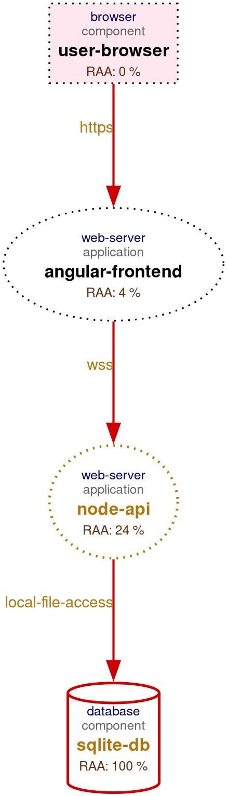

# Threagile POC: OWASP Juice Shop

This repository demonstrates the use of **Threagile**, an open-source tool for "Agile Threat Modeling." It allows you to define your architecture in a YAML file and automatically generate threat models, data flow diagrams, and risk reports.

## Overview

The goal of this POC is to model the architecture of the **OWASP Juice Shop** and identify potential security risks early in the development lifecycle using a "security-as-code" approach.

## 1. The Input Model (`juice-shop.yaml`)

The core of Threagile is the model file. In this directory, `juice-shop.yaml` defines:

- **Information Assets:** Data like `user-credentials`.
- **Trust Boundaries:** Network segments such as `public-internet` and `internal-network`.
- **Technical Assets:** Components like the `angular-frontend`, `node-api`, and `sqlite-db`.
- **Communication Links:** How data flows between assets (e.g., HTTPS from browser to frontend).

Review the file to see how security properties (like encryption, authentication, and authorization) are declared.

## 2. Running Threagile

To process the model and generate the security artifacts, the following command is typically used:

```bash
threagile -model juice-shop.yaml -output .
```

This command parses the YAML, applies built-in risk rules, and renders the output files.

## 3. Reviewing the Results

After execution, Threagile generates several key artifacts found in this directory:

### Visual Diagrams
- **`data-flow-diagram.png`**: An automatically generated DFD showing trust boundaries and communication paths.
  
- **`data-asset-diagram.png`**: Visualizes which assets process or store specific data types.
  

### Comprehensive Reports
- **`report.pdf`**: A high-level executive summary and detailed technical breakdown of all identified risks.
- **`risks.json` / `risks.xlsx`**: A structured list of security risks categorized by severity (Critical, High, Medium, Low).

### Statistics and Metadata
- **`stats.json`**: Quantitative data about the threat model (e.g., number of assets, links, and risks).
- **`tags.xlsx`**: A summary of tags used across assets for categorization and reporting.
- **`technical-assets.json`**: A machine-readable export of the modeled architecture.

## 4. Key Findings

By analyzing the `risks.xlsx` or the `report.pdf`, you can identify common architectural flaws such as:
- Unencrypted communication across trust boundaries.
- Missing authentication on critical internal APIs.
- Potential SQL injection points based on the technology stack (e.g., SQLite).

## Summary

Threagile transforms manual threat modeling into a repeatable, automated process that fits into a modern CI/CD pipeline. By maintaining the `juice-shop.yaml` file alongside the source code, security becomes a primary citizen of the development workflow.

## Workflows to Investigate
**Workflow 1: LLM as YAML Generator**
IaC/Diagram/Prose → LLM Prompt → `threagile.yaml` → Human Review → `docker run threagile` → Risk Report

**Workflow 2: Agentic YAML Generation**
IaC/Diagram Ingest → Asset Extraction → Trust Boundary Detection → Data Flow Mapping → YAML Synthesis → `threagile` Run → Risk Report Parse → Finding Triage/Ticket Creation

**Workflow 3: STRIDE-GPT Complementary Layer**
Prose/Diagram → STRIDE-GPT (first-pass STRIDE) → Translate Findings → `threagile.yaml` → CI/CD Tracking

**Workflow 4: LLM-Assisted Custom Risk Rules**
Natural Language Policy → LLM → Go Rule Code → Threagile `.so` Plugin → Extended Ruleset

**Workflow 5: CI/CD Integration**
Code Commit → GitHub Action (Threagile) → JSON Risk Output → LLM Triage Script → Jira/Tickets
